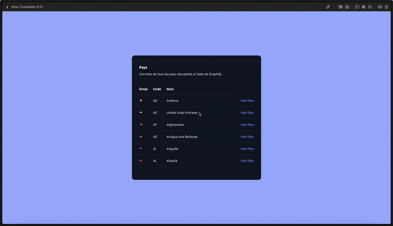

# 🌍 GraphQL & React-Relay - Liste des Pays

Un projet utilisant **GraphQL** et **React-Relay** pour récupérer une liste de pays depuis une API publique et exploiter leurs informations.

## 🎥 Démo



## 📌 Objectifs de l'exercice

### ✅ GraphQL & React-Relay
1. **Installer `react-relay` et configurer un client GraphQL.**
2. **Récupérer la liste des pays** et les afficher dans un tableau avec les colonnes suivantes :
    - **🇫🇷 Emoji**
    - **🌎 Code du pays**
    - **📍 Nom du pays**
3. **Utiliser un Fragment Relay** pour récupérer l’information uniquement dans le composant qui l’affiche.
4. **Au clic sur un pays**, afficher **les informations détaillées** :
    - Langues parlées
    - Continent
    - Devise
    - Indicatif téléphonique

## 🔗 API GraphQL utilisée

L'API publique utilisée est disponible ici :  
🔗 [GraphQL Countries API](https://studio.apollographql.com/public/countries/variant/current/home)  
Elle permet de récupérer des informations sur les pays.

## 🚀 Installation et Exécution

1. **Cloner le dépôt** :
   ```sh
   git clone git@github.com:Onijjam/extia-tt-exo2-gm.git
   ```
2. **Installer les dépendances** :
   ```sh
   cd extia-tt-exo2-gm
   npm install
   ``` 
3. **Lancer l'application** :
   ```sh
   npm run dev
   ``` 


